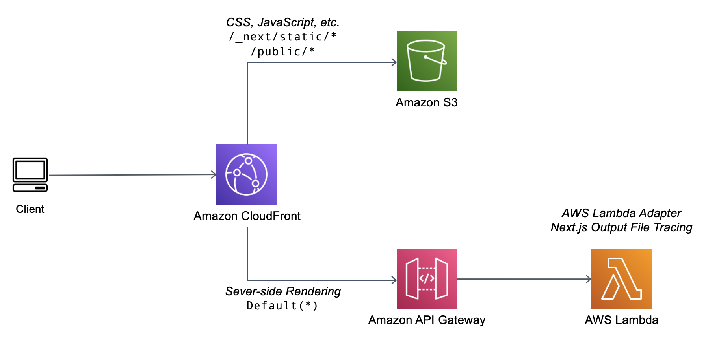

# Running Next.js applications with Serverless services on AWS

This repository how you can run a Next.js application ton Serverless services on 
AWS. There are two methods of deployment, AWS SAM and AWS CDK.

## Solution Architecture

## Requirements
- Node.js 16.x
- Next.js 12.x
- [LambdaAdapterLayerX86:3](https://github.com/awslabs/aws-lambda-web-adapter)
- AWS CDK 2.30.x
- AWS SAM CLI 1.53.x
- Configured aws credentials

## Folder structure
- /nextjs-lambda-cdk - Next.js application deployed with AWS CDK
- /nextjs-lambda-sam - Next.js application deployed with AWS SAM
